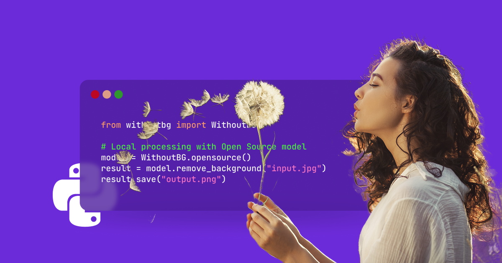
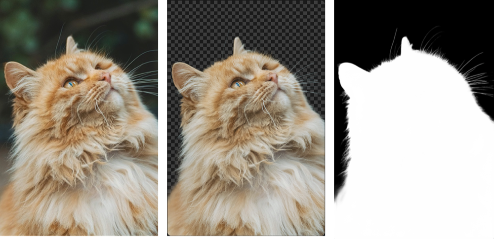
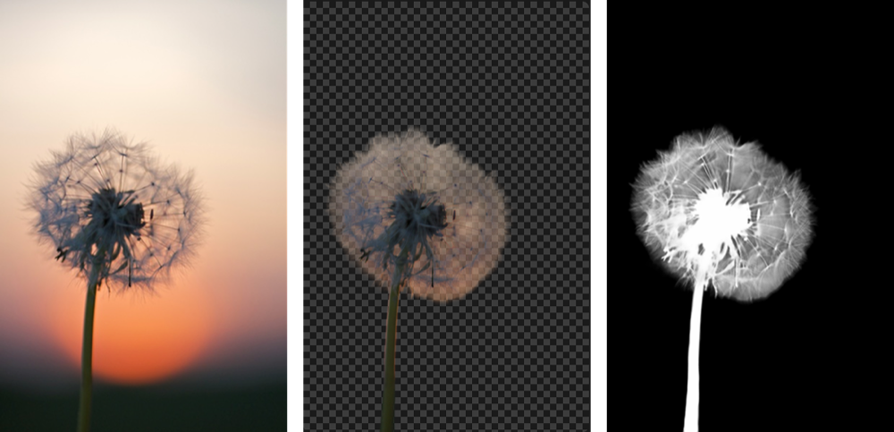
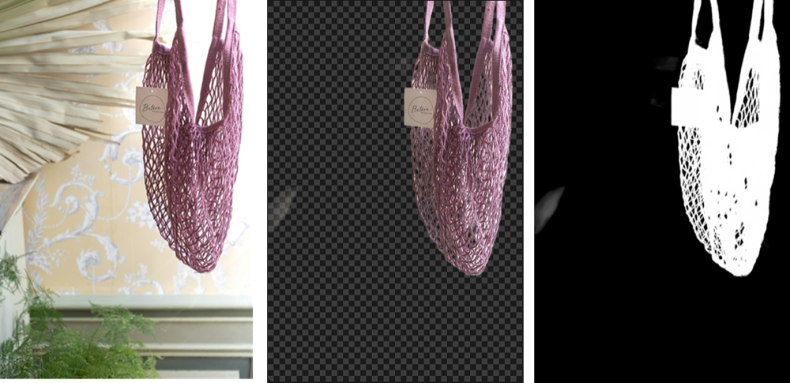

# withoutbg

**Remove backgrounds in Python. Free locally, or use the cloud API.**

[](https://pypi.org/project/withoutbg/)
[](https://opensource.org/licenses/Apache-2.0)
[](https://github.com/withoutbg/withoutbg/actions/workflows/ci.yml)

Two modes that share the same API — run the open-weights model locally (free, private, offline) or call the cloud API (better quality, no GPU, pay per image). Switch with one line of code.

**[View Documentation →](https://withoutbg.com/documentation/integrations/python-sdk?utm_source=github&utm_medium=withoutbg-readme&utm_campaign=main-readme)**

## Try it



```bash
pip install withoutbg
```

```python
from withoutbg import WithoutBG

model = WithoutBG.open_weights()
model.remove_background("photo.jpg").save("result.png")
```

## Choose your mode

| | Local (`open_weights()`) | Cloud (`api()`) |
|---|---|---|
| Cost | Free forever | Pay per image |
| Quality | Good | Better (esp. hair, fur) |
| Privacy | Stays on your machine | Image sent to API |
| GPU required | No (CPU ONNX) | No |
| First-run setup | ~495MB download, once | API key only |
| Best for | Offline, private, batch jobs | Products, occasional use |

**[Compare results →](https://withoutbg.com/resources/compare/focus-vs-pro?utm_source=github&utm_medium=withoutbg-readme&utm_campaign=main-readme)**

```
Need offline or private processing?   → Local
Processing a large batch?             → Local (pay the setup cost once, amortize across all images)
Building a product?                   → Cloud (better quality, zero infra overhead)
Occasional use, no setup tolerance?   → Cloud
```

## Quick start

**Local (withoutBG Open Weights Model):**

```python
from withoutbg import WithoutBG

model = WithoutBG.open_weights()
result = model.remove_background("input.jpg")  # returns PIL Image (RGBA)
result.save("output.png")
```

**Cloud (withoutBG API):**

```python
from withoutbg import WithoutBG

# Pass api_key here, or set WITHOUTBG_API_KEY in the environment
model = WithoutBG.api(api_key="sk_your_key")
result = model.remove_background("input.jpg")
result.save("output.png")
```

**Batch processing:**

```python
from withoutbg import WithoutBG

model = WithoutBG.open_weights()  # load once

images = ["photo1.jpg", "photo2.jpg", "photo3.jpg"]
results = model.remove_background_batch(images, output_dir="results/")
```

**Progress callback:**

```python
def on_progress(value: float) -> None:
    print(f"{value * 100:.0f}%")

result = model.remove_background("photo.jpg", progress_callback=on_progress)
```

See [`examples/`](examples/) for runnable scripts.

## CLI

```bash
# Single image (local model)
withoutbg photo.jpg

# Batch
withoutbg ~/Photos/vacation/ --batch --output-dir ~/Photos/no-bg/

# Cloud API
export WITHOUTBG_API_KEY=sk_your_key
withoutbg photo.jpg --use-api

# JPEG output with white background fill
withoutbg portrait.jpg --format jpg --quality 95

withoutbg --help
```

## Example outputs

**[See Local model results →](https://withoutbg.com/resources/background-removal-results/model-focus-open-source?utm_source=github&utm_medium=withoutbg-readme&utm_campaign=main-readme)**
**[See Cloud API results →](https://withoutbg.com/resources/background-removal-results/model-pro-api?utm_source=github&utm_medium=withoutbg-readme&utm_campaign=main-readme)**






## What gets returned

All methods return a PIL `Image` in RGBA mode:

```python
result = model.remove_background("photo.jpg")  # PIL Image, RGBA

result.save("output.png")   # PNG — preserves transparency
result.save("output.webp")  # WebP — also supports transparency
result.save("output.jpg")   # JPEG — transparency is dropped silently
```

## Configuration

| Environment variable | Effect |
|---|---|
| `WITHOUTBG_API_KEY` | API key for Cloud mode (alternative to passing `api_key=`) |
| `WITHOUTBG_MODEL_PATH` | Path to a local `.onnx` file (skips Hugging Face download) |

When using `WITHOUTBG_MODEL_PATH`, the sidecar metadata file (`withoutbg-open-weights.onnx.json`) must be in the same directory.

## Performance

| | Local | Cloud |
|---|---|---|
| First run | 5–10s (~495MB download) | 1–3s |
| Per image | 2–5s | 1–3s |
| RAM | ~2GB | None |
| Disk | 495MB (one-time cache) | None |

Keep the model object alive across all images in a batch. Recreating it for every image reloads the weights each time.

## Troubleshooting

**Model download fails:** The weights are pulled from [Hugging Face](https://huggingface.co/withoutbg/withoutbg-openweights-onnx) on first run (~495MB). Check your connection, or set `WITHOUTBG_MODEL_PATH` to a local copy.

**Out of memory:** The local model uses ~2GB of RAM. Reduce batch size or switch to Cloud mode.

**Import error:**

```bash
which python
pip list | grep withoutbg
pip install withoutbg
```

**API key rejected:** Get a key at [withoutbg.com](https://withoutbg.com). Set `export WITHOUTBG_API_KEY=sk_your_key`.

**Migrating from older API names** (`WithoutBG.opensource()`, `ProAPI`): see [docs/MIGRATION.md](docs/MIGRATION.md).

## Error handling

```python
from withoutbg import WithoutBG, APIError, WithoutBGError

try:
    model = WithoutBG.api()
    result = model.remove_background("photo.jpg")
    result.save("output.png")
except APIError as e:
    print(f"API error: {e}")
except WithoutBGError as e:
    print(f"Processing error: {e}")
```

## Model

The withoutBG Open Weights Model is a unified WBGNet ONNX graph hosted at [withoutbg/withoutbg-openweights-onnx](https://huggingface.co/withoutbg/withoutbg-openweights-onnx). It runs depth estimation, segmentation, matting, and refinement in a single inference pass at up to 768px output resolution. Licensed under the [withoutBG Open Model License](https://withoutbg.com/open-weights-model/license) (Apache 2.0 for withoutBG portions; Meta DINOv3 License for DINOv3 backbone weights). Built with DINOv3.

## Development

```bash
uv sync --extra dev
# or: pip install -e ".[dev]"

make test-fast    # fast unit tests
make quality      # lint + format + type check
make test         # full suite (downloads model on first run)
```

See [CONTRIBUTING.md](CONTRIBUTING.md) for the full guide.

## Related projects

Need a browser UI or HTTP API instead of Python?

[**withoutbg-inference**](https://github.com/withoutbg/withoutbg-inference) — Docker images (CPU + GPU), FastAPI inference service, and optional web UI built on the same open-weights model.

```bash
docker run --rm -p 8080:8080 withoutbg/withoutbg-openweights-v3-app-cpu
```

## License

This Python SDK is licensed under Apache License 2.0. See [LICENSE](LICENSE).

The withoutBG Open Weights Model is a composite artifact with additional terms
for embedded DINOv3 weights. See the
[withoutBG Open Model License](https://withoutbg.com/open-weights-model/license),
[LICENSE-DINOv3](LICENSE-DINOv3), and [NOTICE](NOTICE).

### Third-party components

- **DINOv3 (Meta)**: Meta DINOv3 License — backbone weights in the Open Weights Model
- **Depth Anything V2**: Apache 2.0
- **ISNet**: Apache 2.0

See [THIRD_PARTY_LICENSES.md](THIRD_PARTY_LICENSES.md) for complete attribution.

## Support

- **Bugs / questions:** [GitHub Issues](https://github.com/withoutbg/withoutbg/issues)
- **Discussion:** [GitHub Discussions](https://github.com/withoutbg/withoutbg/discussions)
- **Commercial:** [contact@withoutbg.com](mailto:contact@withoutbg.com)
- **Security:** [security@withoutbg.com](mailto:security@withoutbg.com) — see [SECURITY.md](SECURITY.md)
